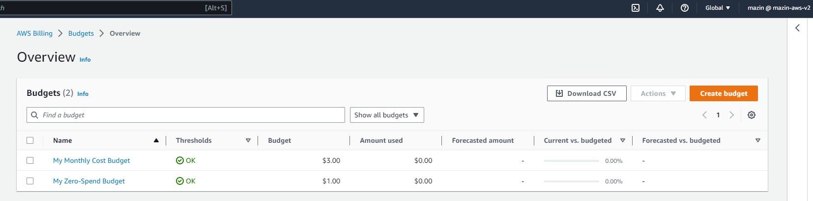

# week 0  - Billing and Architecture 

## Requird Homework/ Tasks

### Install and Verify AWS CLI

I decide to use a local enviroment and AWS CLI.
I will provide the instructions I used for my configration on local machine windows.

I did the following steps to install AWS CLI.

I installed the AWS command line for windows 10 via command in **Command Prompt**:

I followed the instructions on the [AWS CLI Install Documentation Page ](https://docs.aws.amazon.com/cli/latest/userguide/getting-started-install.html)


```
msiexec.exe /i https://awscli.amazonaws.com/AWSCLIV2.msi
```


### Create a Billing Alarm

 I created my own two budject as bellow 
 
 

### Recreate Logical Architectual Diagram in Lucid Charts


[Lucid charts share Link](https://lucid.app/lucidchart/27b28031-62ec-4ba3-8485-8450c6114ad4/edit?viewport_loc=-981%2C-1534%2C2800%2C1243%2C0_0&invitationId=inv_36d944e3-e11c-4bef-ad61-2cfbdfddc819)

