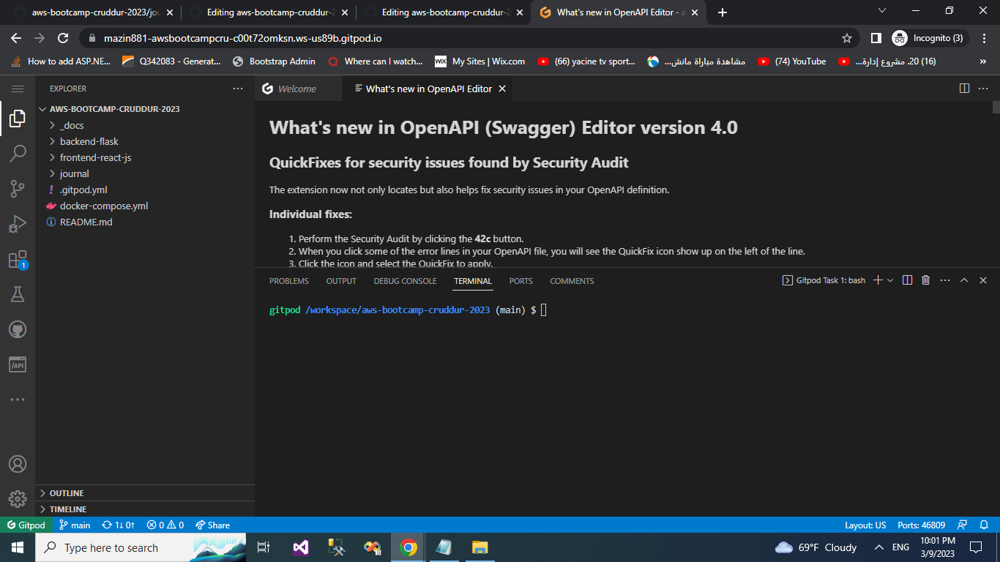

# week 1  - Containerize Application 

## Requird Homework/ Tasks

### Launch the repo within a Gitpod workspace

- I Created a new GitHub repo

- I Launch the repo within a Gitpod workspace

- I Configured Gitpod.yml configuration, eg. I’m VSCode Extensions

- I Cloned the frontend and backend repo



## Containerize Backend

### Inside Container
### install the python libraries used for the app
RUN pip3 install -r requirements.txt

### Run Container

Run 
```sh
docker run --rm -p 4567:4567 -it backend-flask
FRONTEND_URL="*" BACKEND_URL="*" docker run --rm -p 4567:4567 -it backend-flask
export FRONTEND_URL="*"
export BACKEND_URL="*"
docker run --rm -p 4567:4567 -it -e FRONTEND_URL='*' -e BACKEND_URL='*' backend-flask
unset FRONTEND_URL="*"
unset BACKEND_URL="*"
```

Run in background
```sh
docker container run --rm -p 4567:4567 -d backend-flask
```

Return the container id into an Env Vat
```sh
CONTAINER_ID=$(docker run --rm -p 4567:4567 -d backend-flask)
```


> docker container run is idiomatic, docker run is legacy syntax but is commonly used.

### Get Container Images or Running Container Ids

```
docker ps
docker images
```


### Send Curl to Test Server

```sh
curl -X GET http://localhost:4567/api/activities/home -H "Accept: application/json" -H "Content-Type: application/json"
```


### Check Container Logs

```sh
docker logs CONTAINER_ID -f
docker logs backend-flask -f
docker logs $CONTAINER_ID -f
```

###  Debugging  adjacent containers with other containers

```sh
docker run --rm -it curlimages/curl "-X GET http://localhost:4567/api/activities/home -H \"Accept: application/json\" -H \"Content-Type: application/json\""
```

busybosy is often used for debugging since it install a bunch of thing

```sh
docker run --rm -it busybosy
```

### Gain Access to a Container

```sh
docker exec CONTAINER_ID -it /bin/bash
```

> You can just right click a container and see logs in VSCode with Docker extension

### Delete an Image

```sh
docker image rm backend-flask --force
```

> docker rmi backend-flask is the legacy syntax, you might see this is old docker tutorials and articles.

> There are some cases where you need to use the --force

### Overriding Ports

```sh
FLASK_ENV=production PORT=8080 docker run -p 4567:4567 -it backend-flask
```

> Look at Dockerfile to see how ${PORT} is interpolated


```
