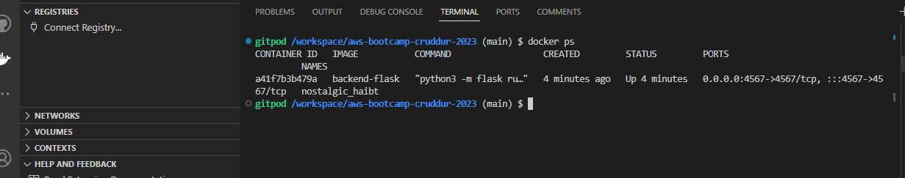
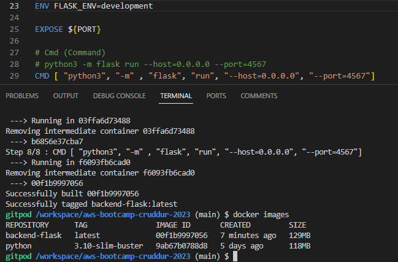
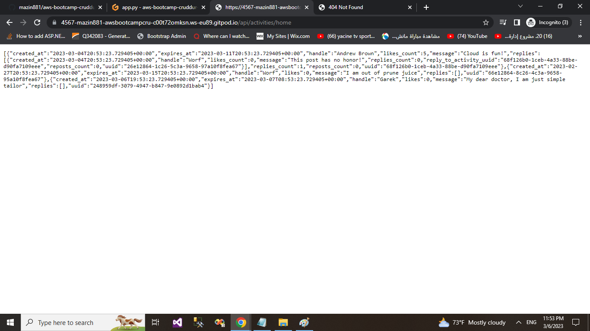

# week 1  - Containerize Application 

## Requird Homework/ Tasks

### Launch the repo within a Gitpod workspace

- I Created a new GitHub repo

- I Launch the repo within a Gitpod workspace

- I Configured Gitpod.yml configuration, eg. I’m VSCode Extensions

- I Cloned the frontend and backend repo


## Containerize Backend

### Inside Container
### install the python libraries used for the app
RUN pip3 install -r requirements.txt

### Run Container

Run 
```sh
docker run --rm -p 4567:4567 -it backend-flask
FRONTEND_URL="*" BACKEND_URL="*" docker run --rm -p 4567:4567 -it backend-flask
export FRONTEND_URL="*"
export BACKEND_URL="*"
docker run --rm -p 4567:4567 -it -e FRONTEND_URL='*' -e BACKEND_URL='*' backend-flask
unset FRONTEND_URL="*"
unset BACKEND_URL="*"
```

Run in background
```sh
docker container run --rm -p 4567:4567 -d backend-flask
```

Return the container id into an Env Vat
```sh
CONTAINER_ID=$(docker run --rm -p 4567:4567 -d backend-flask)
```


> docker container run is idiomatic, docker run is legacy syntax but is commonly used.

### Get Container Images or Running Container Ids

```
docker ps
docker images
```



### Send Curl to Test Server

```sh
curl -X GET http://localhost:4567/api/activities/home -H "Accept: application/json" -H "Content-Type: application/json"
```


### Check Container Logs

```sh
docker logs CONTAINER_ID -f
docker logs backend-flask -f
docker logs $CONTAINER_ID -f
```

###  Debugging  adjacent containers with other containers

```sh
docker run --rm -it curlimages/curl "-X GET http://localhost:4567/api/activities/home -H \"Accept: application/json\" -H \"Content-Type: application/json\""
```

busybosy is often used for debugging since it install a bunch of thing

```sh
docker run --rm -it busybosy
```

### Gain Access to a Container

```sh
docker exec CONTAINER_ID -it /bin/bash
```

### Overriding Ports

```sh
FLASK_ENV=production PORT=8080 docker run -p 4567:4567 -it backend-flask
```

Look at Dockerfile to see how ${PORT} is interpolated

## Containerize Frontend

## Run NPM Install

We have to run NPM Install before building the container since it needs to copy the contents of node_modules

```
cd frontend-react-js
npm i
```

### Create Docker File

Create a file here: `frontend-react-js/Dockerfile`

```dockerfile
FROM node:16.18

ENV PORT=3000

COPY . /frontend-react-js
WORKDIR /frontend-react-js
RUN npm install
EXPOSE ${PORT}
CMD ["npm", "start"]
```

### Build Container

```sh
docker build -t frontend-react-js ./frontend-react-js
```

### Run Container

```sh
docker run -p 3000:3000 -d frontend-react-js
```

